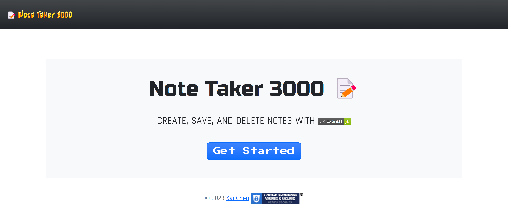
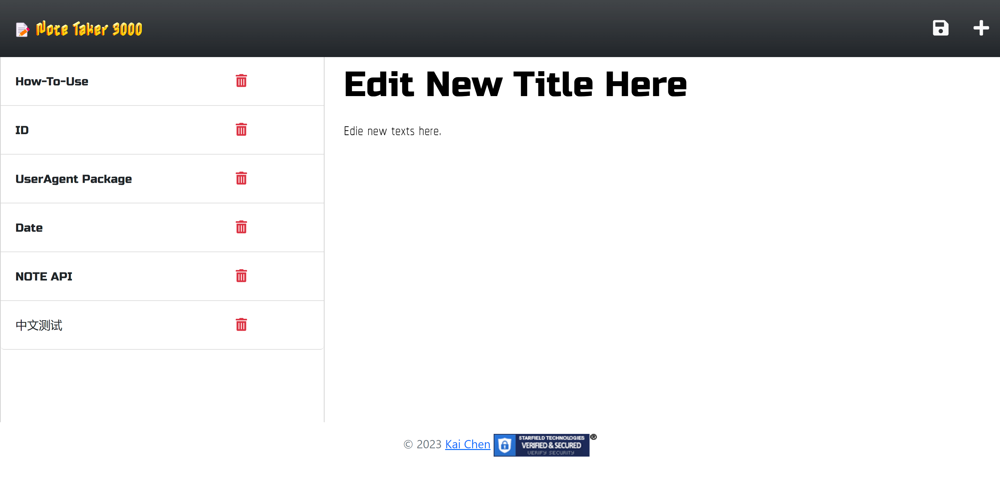

# Note Taker 3000 [](./LICENSE)

* This is an application called [***Note Taker 3000***](https://note-taker-v3000-27717ed21972.herokuapp.com/) that can be used to write and save notes.
* This application will use an [*Express.js*](https://expressjs.com/) back end and will save and retrieve note data from a *JSON* file.
* This application is also deployed to [*Heroku*](https://www.heroku.com) as ***[Note-Taker-v3000](https://note-taker-v3000-27717ed21972.herokuapp.com/)***

## Table of Contents

* [Description](#description)
* [Technology](#technology)
* [Installation](#installation)
* [Usage](#usage)
* [Test](#test)
* [Screenshots](#screenshots)
* [Links](#links)
* [License](#license)

## Description

```md
AS A small business owner
I WANT to be able to write and save notes
SO THAT I can organize my thoughts and keep track of tasks I need to complete
```

[*back to top*](#table-of-contents)

## Technology

* [](https://devcenter.heroku.com/articles/heroku-cli)
* [](https://nodejs.org/en)

* [](https://docs.npmjs.com/cli/v9/)
  * [](https://expressjs.com/)
  * [](https://www.npmjs.com/package/uuid)

[*back to top*](#table-of-contents)

## Installation

* Packages to support this application can be installed by using [*npm install*](https://docs.npmjs.com/cli/v9/commands/npm-install) commands.

> **Note**: If you do not have a `package.json` in your directory already, enter command below to [*initiate*](https://docs.npmjs.com/cli/v9/commands/npm-init).
>
>```bash
>npm init -y
>```
>
>then
>
>```bash
>npm install express@4.18.2 uuid@9.0.0
>```
>
> **Important**: To guarantee this web app runs with the current `package.json`, please make sure to `@` the **EXACT** versions as indicated above.

[*back to top*](#table-of-contents)

## Usage

* This application can be invoked by using the following command:

```bash
npm start
```

* Workflow:

```md
GIVEN a note-taking application
WHEN I open the Note Taker 3000
THEN I am presented with a landing page with a link to a notes page
WHEN I click on the link to the notes page
THEN I am presented with a page with existing notes listed in the left-hand column, plus empty fields to enter a new note title and the note’s text in the right-hand column
WHEN I enter a new note title and the note’s text
THEN a SAVE icon appears in the navigation at the top of the page
WHEN I click on the SAVE icon
THEN the new note I have entered is saved and appears in the left-hand column with the other existing notes
WHEN I click on an existing note in the list in the left-hand column
THEN that note appears in the right-hand column
WHEN I click on the PLUS-SIGN icon in the navigation at the top of the page
THEN I am presented with empty fields to enter a new note title and the note’s text in the right-hand column
WHEN I click on the DELETE icon in the left-hand column
THEN the corespondent note inline with the DELETE icon will be erased.
```

[*back to top*](#table-of-contents)

## Test

While there is yet a test script written for this application, you can still **test** the functions of this application **locally** by running the command below:

```bash
npm start
```

then in your browser of choice, navigate to the *localhost URL* below:

```md
http://localhost:3000
```

[*back to top*](#table-of-contents)

## Screenshots

* Main Page

* Note List View

* Note Edit

* Note Save

* Note Delete


[*back to top*](#table-of-contents)

## Links

[](https://rb.gy/zsevz)

* GitHub Repo: [Note-Taker](https://github.com/Ronin1702/Note-Taker)
* Heroku Deployment: [Note-Taker-v3000](https://note-taker-v3000-27717ed21972.herokuapp.com/)

[*back to top*](#table-of-contents)

## License

* This application is licensed by [](./LICENSE).

[*back to top*](#table-of-contents)
- - -

